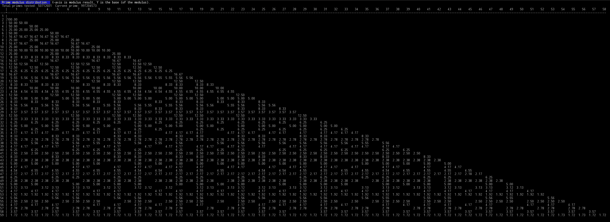

Distribution of least-significant-digit of various bases of prime numbers

Author: jaggz.h is at gmail.com
  Date: 2017-05-19
 
A paper from 2016 discusses the non-random distribution of the remainder
(least significant digit) of prime numbers.  This program displays the
distribution of remainders with varying bases.

Article: https://arxiv.org/abs/1603.03720
  Title: Unexpected biases in the distribution of consecutive primes
Authors: Robert J. Lemke Oliver, and Kannan Soundararajan
   Date: 2016-05-30

Relevant files:
  primesieve-distr.c

Notes:
  1. This is limited to 64 bit integers, and doubles.
  2. It doesn't look at screen width.
     Modify the line: "#define BASES 36", in the .c file, for more/less columns.

Compiling:
  1. Requires (lib)primesieve https://github.com/kimwalisch/primesieve
  2. primesieve installs, on my system, to /usr/local/lib/
     You might need to modify the Makefile to point to another folder
  3. Then run make.  It should compile and run ./primesieve-distr

  Example output:
  

